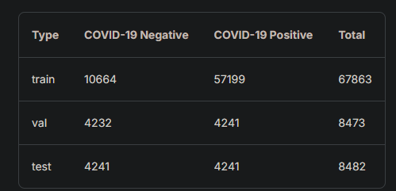
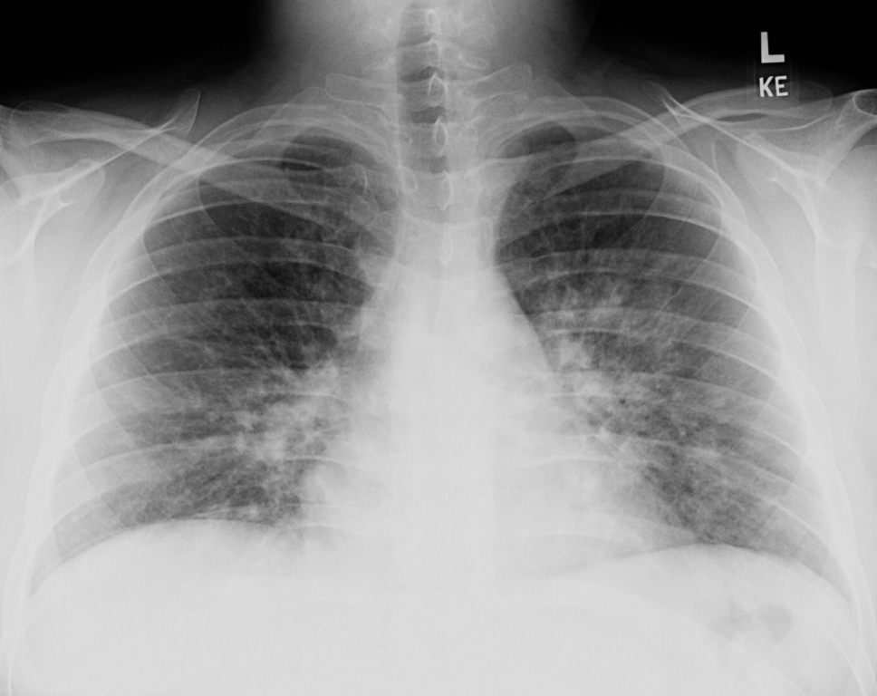
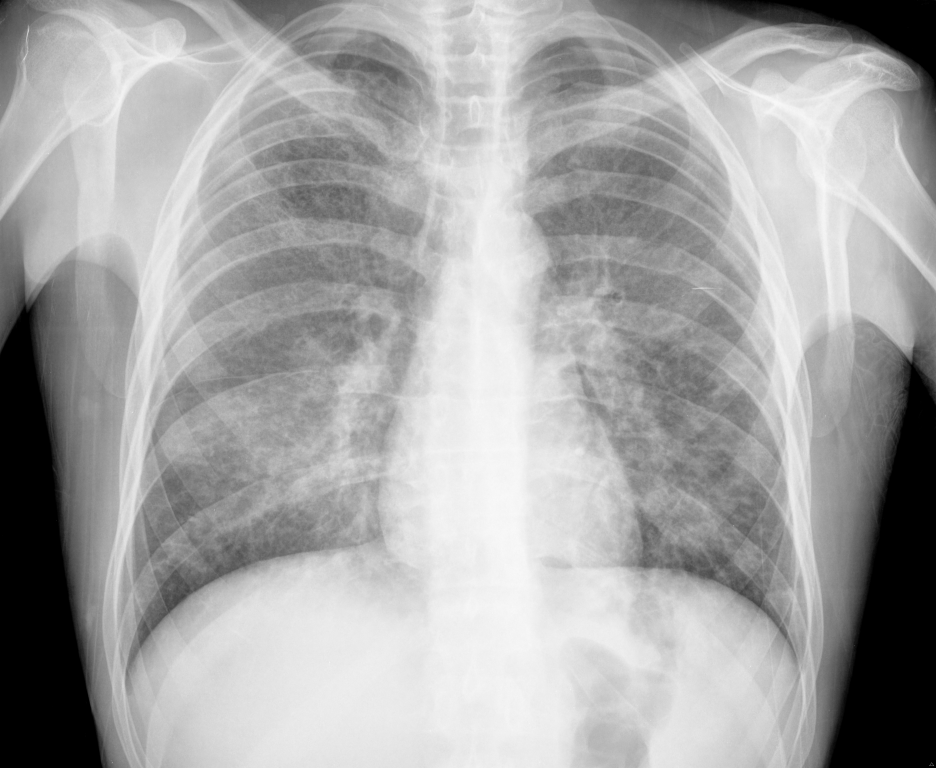
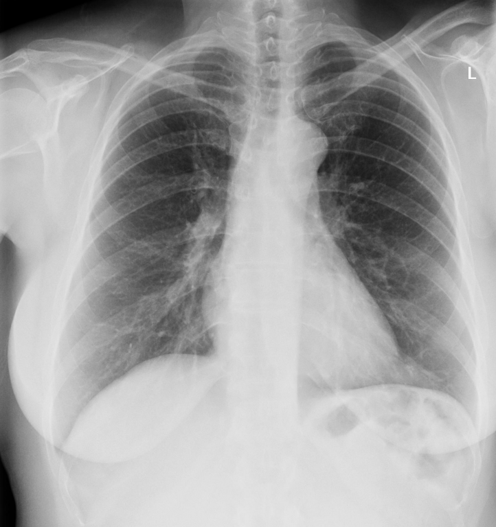

# COVID-TL

El objetivo de este proyecto sera utilizar un modelo basado en cnn (convolutional neural network) aplicando transfer learning para la deteccion de COVID-19 en imagenes de rayos X de pechos de pacientes con y sin COVID-19.

El [dataset](https://www.kaggle.com/datasets/andyczhao/covidx-cxr2) a utilizar contiene ~85k imagenes de rayos x de pechos de pacientes con y sin covid-19.

# Informacion de dataset:

Segun el link dispuesto, tenemos la siguiente informacion del dataset.

Las imagenes son del siguiente tipo:

Es importante destacar que *las imagenes no tienen una resolucion estandar*. Lo anterior implica agregar tecnicas de Resizing previo al entrenamiento.

