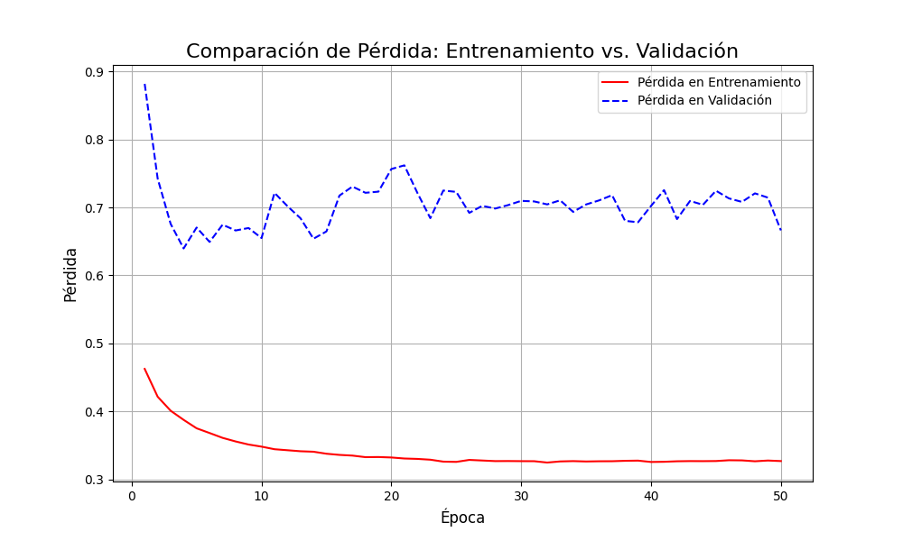
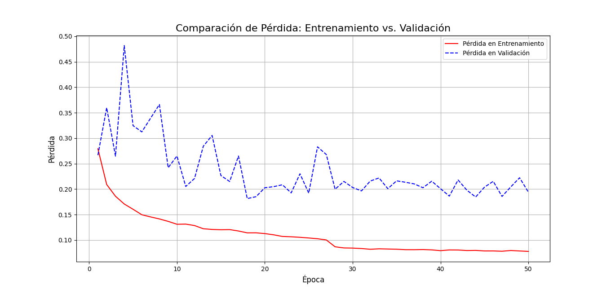

# COVID-TL

El objetivo de este proyecto será utilizar un modelo basado en cnn (convolutional neural network) aplicando transfer learning para la detección de COVID-19 en imágenes de rayos X de pechos de pacientes con y sin COVID-19.

El [dataset](https://www.kaggle.com/datasets/andyczhao/covidx-cxr2) a utilizar contiene ~85k imágenes de rayos x de pechos de pacientes con y sin covid-19.

# Información de dataset:

Según el link dispuesto, tenemos la siguiente información del dataset.


Las imágenes son del siguiente tipo:


Es importante destacar que *las imagenes no tienen una resolución estándar*. Lo anterior implica agregar técnicas de Resizing previo al entrenamiento.


# Carga de rutas de imágenes

A través de la siguiente función se crearon los datasets que almacenarán las rutas de las imágenes que se usarán para entrenamiento:

```python

# utils/load_dataset.py

import os

def load_dataset(type_, data_path):
    """
        Función creada para generar los paths_sets
        de las imágenes teniendo en cuenta la estructura
        de almacenamiento de las imágenes:
        o

    {data_path} 
    ├───test
    ├───train
    └───val
    ├─── test.txt
    ├─── val.txt
    ├─── test.txt
        
    """
    if type_ not in ['train', 'test', 'val']:
        raise Exception("Parametro con valor invalido !")

    file_path = os.path.join(data_path, f"{type_}.txt")
    X = []
    Y = []

    with open(file_path, 'r') as file_:
        for i, line in enumerate(file_):
            file_path = os.path.join(data_path, f"{type_}/{line.split(' ')[1]}")
            target = 1 if line.split(" ")[2] == 'positive' else 0
            X.append(file_path)
            Y.append(target)

    return X, Y

```
# Obtención de métricas para normalizar

Para poder normalizar un conjunto de datos (necesario para el entrenamiento de redes neuronales)
se deben encontrar dos matrices: media y desviación estándar.

Estas dos métricas se obtienen del conjunto de imágenes de entrenamiento por cada canal.

Para lograrlo, utilizamos la siguiente función:

```python

# utils/normalization_metrics_calc.py

import numpy as np
from torch.utils.data import DataLoader

def normalization_metrics_calc(dataset):
    loader = DataLoader(dataset=dataset, batch_size=1, num_workers=8)

    n_pixels_total = 0
    sum_rgb = np.zeros(3, dtype=np.float64)
    sum_sq_rgb = np.zeros(3, dtype=np.float64)

    for i, image in enumerate(loader):
        print(f"{i}/{len(dataset)}", end="\r")
        image = image[0]
        array = image.squeeze(0).numpy().astype(np.float32) / 255.0  # Escalar a [0,1]
        h, w, _ = array.shape
        n_pixels = h * w
        n_pixels_total += n_pixels

        # Suma de valores y suma de cuadrados por canal
        sum_rgb += array.reshape(-1, 3).sum(axis=0)
        sum_sq_rgb += (array.reshape(-1, 3) ** 2).sum(axis=0)

    mean = sum_rgb / n_pixels_total
    std = np.sqrt(sum_sq_rgb / n_pixels_total - mean ** 2)

    return mean.tolist(), std.tolist()
```

Esta función toma un dataset que wrappea la lista de rutas de imágenes y lo recorre, dicho dataset es el siguiente:

```python

# utils/NormDataset.py

from torchvision import transforms
import numpy as np
from PIL import Image
import torch

class NormDataset(torch.utils.data.Dataset):
    """
        Dataset creado para wrappear los
        paths_sets para encontrar los valores de normalización
        en el trainset (media y desviación estándar por canal)
    """

    def __init__(self, X) -> None:
        self.X = X

    def __len__(self):
        return len(self.X)

    def __getitem__(self, idx):
        image = Image.open(self.X[idx]).convert('RGB')
        image_arr = np.array(image)
        image.close()
        return image_arr

```

En el `main.py`:

```python

# main.py

import kagglehub
from utils.NormDataset import NormDataset
from utils.load_dataset import load_dataset
from utils.normalization_metrics_calc import normalization_metrics_calc

if __name__ == "__main__":

    data_path = kagglehub.dataset_download("andyczhao/covidx-cxr2")
    train_X, train_Y = load_dataset('train', data_path)
    val_X, val_Y = load_dataset('val', data_path)
    test_X, test_Y = load_dataset('test', data_path)

    trainset = NormDataset(train_X)
    print(normalization_metrics_calc(trainset))
```

Encontramos los siguientes datos:

```

media : [0.5162912460480391, 0.5162851561852722, 0.5162961087834854]

std : [0.24806341486746794, 0.24806204203020304, 0.248068391383844]
```

# Esqueleto de entrenamiento

Usando el siguiente código, se hicieron las primeras pruebas:

```python

# main.py

import kagglehub
import numpy as np
import torch
from torch.utils.data import DataLoader
from utils.NormDataset import NormDataset
from utils.load_dataset import load_dataset
from utils.load_model import load_model
from utils.normalization_metrics_calc import normalization_metrics_calc
from utils.ImagesDataset import ImagesDataset
from torchvision import transforms
from utils.MACROS import BATCH_SIZE, EPOCHS, MEANS, STDS
import torchvision

if __name__ == "__main__":

    data_path = kagglehub.dataset_download("andyczhao/covidx-cxr2")
    DEVICE = 'cuda' if torch.cuda.is_available() else 'cpu'

    train_transformer  = transforms.Compose([

        # basic resize
        
        transforms.Resize((256, 256)), # redimensionar 
        transforms.CenterCrop((224, 224)), # recordar desde el centro para consistencia
        
        # data augmentation

        transforms.RandomHorizontalFlip(),
        transforms.ColorJitter(0.4, 0.4, 0.4, 0.1),
        transforms.RandomRotation(15),


        transforms.ToTensor(),
        transforms.Normalize(MEANS, STDS)
    ])

    val_transformer = transforms.Compose([
        transforms.Resize((256, 256)), 
        transforms.CenterCrop((224, 224)), 

        transforms.ToTensor(),
        transforms.Normalize(MEANS, STDS)
    ])

    trainset = ImagesDataset(*load_dataset('train', data_path), train_transformer)
    valset = ImagesDataset(*load_dataset('val', data_path), val_transformer)
    testset = ImagesDataset(*load_dataset('test', data_path), val_transformer)


    trainloader = DataLoader(trainset, BATCH_SIZE, shuffle=True, num_workers=8, persistent_workers=True, pin_memory=True)
    valloader = DataLoader(valset, BATCH_SIZE, shuffle=True, num_workers=8, persistent_workers=True, pin_memory=True)

    model = load_model(2).to(DEVICE)

    optimizer = torch.optim.Adam(model.parameters(), lr=1e-4)
    criterion = torch.nn.CrossEntropyLoss()

    for i in range(EPOCHS):

        batches_train_loss = []
        batches_val_loss = []

        for a, (X_batch, Y_batch) in enumerate(trainloader):
            print(f"batch : {a}/{len(trainloader)}", end="\r")
            X_batch, Y_batch = X_batch.to(DEVICE), Y_batch.to(DEVICE)

            optimizer.zero_grad()

            output = model(X_batch)
            loss = criterion(output, Y_batch)
            loss.backward()
            optimizer.step()


            batches_train_loss.append(loss.item())

        print("\n\n")

```

# Implementación de procesamiento de valset

Se implementó el procesamiento del valset para revisar el rendimiento del modelo en validación:

```python

# main.py

import kagglehub
import numpy as np
import torch
from torch.utils.data import DataLoader
from utils.NormDataset import NormDataset
from utils.load_dataset import load_dataset
from utils.load_model import load_model
from utils.normalization_metrics_calc import normalization_metrics_calc
from utils.ImagesDataset import ImagesDataset
from torchvision import transforms
from utils.MACROS import BATCH_SIZE, EPOCHS, IMAGE_SIZE, MEANS, STDS
import torchvision

if __name__ == "__main__":

    data_path = kagglehub.dataset_download("andyczhao/covidx-cxr2")
    DEVICE = 'cuda' if torch.cuda.is_available() else 'cpu'

    train_transformer  = transforms.Compose([

        # basic resize
        
        transforms.Resize((IMAGE_SIZE[0], IMAGE_SIZE[1])), # redimensionar 
        transforms.CenterCrop((IMAGE_SIZE[0]*0.9, IMAGE_SIZE[1]*0.9)), # recordar desde el centro para consistencia
        
        # data augmentation

        transforms.RandomHorizontalFlip(),
        transforms.ColorJitter(0.4, 0.4, 0.4, 0.1),
        transforms.RandomRotation(15),


        transforms.ToTensor(),
        transforms.Normalize(MEANS, STDS)
    ])

    val_transformer = transforms.Compose([
        transforms.Resize((IMAGE_SIZE[0], IMAGE_SIZE[1])), # redimensionar 
        transforms.CenterCrop((IMAGE_SIZE[0]*0.9, IMAGE_SIZE[1]*0.9)), # recordar desde el centro para consistencia
        

        transforms.ToTensor(),
        transforms.Normalize(MEANS, STDS)
    ])

    trainset = ImagesDataset(*load_dataset('train', data_path), train_transformer)
    valset = ImagesDataset(*load_dataset('val', data_path), val_transformer)
    testset = ImagesDataset(*load_dataset('test', data_path), val_transformer)


    trainloader = DataLoader(trainset, BATCH_SIZE, shuffle=True, num_workers=12, persistent_workers=True, pin_memory=True)
    valloader = DataLoader(valset, BATCH_SIZE, shuffle=False, num_workers=5, persistent_workers=True, pin_memory=True)

    model = load_model(2).to(DEVICE)

    optimizer = torch.optim.Adam(model.parameters(), lr=1e-4)
    criterion = torch.nn.CrossEntropyLoss()

    for i in range(EPOCHS):

        batches_train_loss = []
        batches_val_loss = []
        batches_val_prec =[]
        
        model.train()
        for a, (X_batch, Y_batch) in enumerate(trainloader):
            print(f"train batch : {a}/{len(trainloader)}", end="\r")
            X_batch, Y_batch = X_batch.to(DEVICE), Y_batch.to(DEVICE)

            optimizer.zero_grad()

            output = model(X_batch)
            loss = criterion(output, Y_batch)
            loss.backward()
            optimizer.step()


            batches_train_loss.append(loss.item())

        print("\n\n")

        model.eval()

        with torch.no_grad():
            for a, (X_batch, Y_batch) in enumerate(valloader):
                print(f"val batch : {a}/{len(valloader)}", end="\r")
                X_batch, Y_batch = X_batch.to(DEVICE), Y_batch.to(DEVICE)

                output = model(X_batch)
                loss = criterion(output, Y_batch)
                _, prediction = torch.max(output, 1)
                

                batches_val_loss.append(loss.item())
                batches_val_prec.append((Y_batch == prediction).to("cpu").sum() / len(Y_batch))

        print(f"""
                Epoch : {i+1}/{EPOCHS}

                    Train loss: {np.mean(batches_train_loss)}
                    Val loss: {np.mean(batches_val_loss)}
                    Val precision : {np.mean(batches_val_prec)}
        """)

```

# Implementación de LR Scheduling y Weight Decay

```python

    # main.py
    
    ...

    optimizer = torch.optim.Adam(model.parameters(), lr=1e-4, weight_decay=1e-4)
    criterion = torch.nn.CrossEntropyLoss()
    # cada 8 epocas se revisa si la precisión en validacion mejoro para ver si se disminuye el lr
    scheduler = torch.optim.lr_scheduler.ReduceLROnPlateau(optimizer, mode="max",patience=8)

    ...

    for i in range(EPOCHS):

        ...
       
        model.train()

        for a, (X_batch, Y_batch) in enumerate(trainloader):
            ...

        model.eval()

        with torch.no_grad():
            for a, (X_batch, Y_batch) in enumerate(valloader):
                ...

        scheduler.step(np.mean(batches_val_prec))

```

# Session 1: performance de resnet18.

Usando el siguiente código:

```python

# main.py

import kagglehub
import time
import numpy as np
import torch
from torch.utils.data import DataLoader
from utils.NormDataset import NormDataset
from utils.load_dataset import load_dataset
from utils.load_model import load_model
from utils.normalization_metrics_calc import normalization_metrics_calc
from utils.ImagesDataset import ImagesDataset
from torchvision import transforms
from utils.MACROS import BATCH_SIZE, EPOCHS, IMAGE_SIZE, MEANS, STDS
import torchvision

from utils.plot_model_performance import plot_model_performance

if __name__ == "__main__":

    data_path = kagglehub.dataset_download("andyczhao/covidx-cxr2")
    DEVICE = 'cuda' if torch.cuda.is_available() else 'cpu'

    train_transformer  = transforms.Compose([

        # basic resize
        
        transforms.Resize((IMAGE_SIZE[0], IMAGE_SIZE[1])), # redimensionar 
        transforms.CenterCrop((IMAGE_SIZE[0]*0.9, IMAGE_SIZE[1]*0.9)), # recordar desde el centro para consistencia
        
        # data augmentation

        transforms.RandomHorizontalFlip(),
        transforms.ColorJitter(0.4, 0.4, 0.4, 0.1),
        transforms.RandomRotation(15),


        transforms.ToTensor(),
        transforms.Normalize(MEANS, STDS)
    ])

    val_transformer = transforms.Compose([
        transforms.Resize((IMAGE_SIZE[0], IMAGE_SIZE[1])), # redimensionar 
        transforms.CenterCrop((IMAGE_SIZE[0]*0.9, IMAGE_SIZE[1]*0.9)), # recordar desde el centro para consistencia
        

        transforms.ToTensor(),
        transforms.Normalize(MEANS, STDS)
    ])

    trainset = ImagesDataset(*load_dataset('train', data_path), train_transformer)
    valset = ImagesDataset(*load_dataset('val', data_path), val_transformer)
    testset = ImagesDataset(*load_dataset('test', data_path), val_transformer)


    trainloader = DataLoader(trainset, BATCH_SIZE, shuffle=True, num_workers=8, persistent_workers=True, pin_memory=True)
    valloader = DataLoader(valset, BATCH_SIZE, shuffle=False, num_workers=4, persistent_workers=True, pin_memory=True)

    model = load_model(2).to(DEVICE)
    optimizer = torch.optim.Adam(model.parameters(), lr=1e-4, weight_decay=1e-4)
    criterion = torch.nn.CrossEntropyLoss()
    scheduler = torch.optim.lr_scheduler.ReduceLROnPlateau(optimizer, mode="max",patience=8)

    epochs_train_loss = []
    epochs_val_loss = []

    for i in range(EPOCHS):
        t1 = time.time()

        batches_train_loss = []
        batches_val_loss = []
        batches_val_prec =[]
        
        model.train()
        for a, (X_batch, Y_batch) in enumerate(trainloader):
            print(f"train batch : {a}/{len(trainloader)}", end="\r")
            X_batch, Y_batch = X_batch.to(DEVICE), Y_batch.to(DEVICE)

            optimizer.zero_grad()

            output = model(X_batch)
            loss = criterion(output, Y_batch)
            loss.backward()
            optimizer.step()


            batches_train_loss.append(loss.item())

        print("\n\n")

        model.eval()

        with torch.no_grad():
            for a, (X_batch, Y_batch) in enumerate(valloader):
                print(f"val batch : {a}/{len(valloader)}", end="\r")
                X_batch, Y_batch = X_batch.to(DEVICE), Y_batch.to(DEVICE)

                output = model(X_batch)
                loss = criterion(output, Y_batch)
                _, prediction = torch.max(output, 1)
                

                batches_val_loss.append(loss.item())
                batches_val_prec.append((Y_batch == prediction).to("cpu").sum() / len(Y_batch))

        print(f"""
                Epoch : {i+1}/{EPOCHS}

                    Train loss: {np.mean(batches_train_loss)}
                    Val loss: {np.mean(batches_val_loss)}
                    Val precision : {np.mean(batches_val_prec)}
                    Time : {time.time()-t1}

                    ___________________________________________
        """)

        epochs_train_loss.append(np.mean(batches_train_loss))
        epochs_val_loss.append(np.mean(batches_val_loss))

        scheduler.step(np.mean(batches_val_prec))
    torch.save(model, "./results/resnet/resnet18.pt")
    torch.save(torch.Tensor(epochs_val_loss), "./results/resnet/epochs_loss.pt")
    plot_model_performance(epochs_train_loss, epochs_val_loss)
```

```python

# utils/load_model.py

import torchvision
from torchvision.models import  resnet18
import torch

def load_model(num_class):
    model = resnet18(weights=torchvision.models.ResNet18_Weights.DEFAULT)

    for param in model.parameters():
        param.requires_grad = False

    num_features = model.fc.in_features
    model.fc = torch.nn.Linear(num_features, num_class)  # 2 clases: COVID / No-COVID
    return model
```

Obtuve los siguientes resultados:

```

                Epoch : 50/50

                    Train loss: 0.3269611576894172
                    Val loss: 0.66620253377101
                    Val precision : 0.6567600965499878
                    Time : 132.3671646118164

                    ___________________________________________
```




# Session 2: performance de SqueezeNet

Cabe destacar que esta vez se hizo fine-tunnig sobre toda la red, no tan solo sobre las capas de clasificación:

Usando el siguiente código:

```python

# main.py

import kagglehub
import time
import numpy as np
import torch
from torch.utils.data import DataLoader
from utils.load_dataset import load_dataset
from utils.load_model import load_model
from utils.ImagesDataset import ImagesDataset
from torchvision import transforms
from utils.MACROS import BATCH_SIZE, EPOCHS, IMAGE_SIZE, MEANS, STDS

from utils.plot_model_performance import plot_model_performance

if __name__ == "__main__":

    data_path = kagglehub.dataset_download("andyczhao/covidx-cxr2")
    DEVICE = 'cuda' if torch.cuda.is_available() else 'cpu'

    train_transformer  = transforms.Compose([

        # basic resize
        
        transforms.Resize((IMAGE_SIZE[0], IMAGE_SIZE[1])), # redimensionar 
        transforms.CenterCrop((IMAGE_SIZE[0]*0.9, IMAGE_SIZE[1]*0.9)), # recordar desde el centro para consistencia
        
        # data augmentation

        transforms.RandomHorizontalFlip(),
        transforms.ColorJitter(0.4, 0.4, 0.4, 0.1),
        transforms.RandomRotation(15),


        transforms.ToTensor(),
        transforms.Normalize(MEANS, STDS)
    ])

    val_transformer = transforms.Compose([
        transforms.Resize((IMAGE_SIZE[0], IMAGE_SIZE[1])), # redimensionar 
        transforms.CenterCrop((IMAGE_SIZE[0]*0.9, IMAGE_SIZE[1]*0.9)), # recordar desde el centro para consistencia
        

        transforms.ToTensor(),
        transforms.Normalize(MEANS, STDS)
    ])

    trainset = ImagesDataset(*load_dataset('train', data_path), train_transformer)
    valset = ImagesDataset(*load_dataset('val', data_path), val_transformer)
    testset = ImagesDataset(*load_dataset('test', data_path), val_transformer)


    trainloader = DataLoader(trainset, BATCH_SIZE, shuffle=True, num_workers=8, persistent_workers=True, pin_memory=True)
    valloader = DataLoader(valset, BATCH_SIZE, shuffle=False, num_workers=8, persistent_workers=True, pin_memory=True)

    model = load_model(2).to(DEVICE)
    optimizer = torch.optim.Adam(model.parameters(), lr=1e-4, weight_decay=1e-4)
    criterion = torch.nn.CrossEntropyLoss()
    scheduler = torch.optim.lr_scheduler.ReduceLROnPlateau(optimizer, mode="max",patience=8)

    epochs_train_loss = []
    epochs_val_loss = []

    for i in range(EPOCHS):
        t1 = time.time()

        batches_train_loss = []
        batches_val_loss = []
        batches_val_prec =[]
        
        model.train()
        for a, (X_batch, Y_batch) in enumerate(trainloader):
            print(f"\t\ttrain batch : {a}/{len(trainloader)}", end="\r")
            X_batch, Y_batch = X_batch.to(DEVICE), Y_batch.to(DEVICE)

            optimizer.zero_grad()

            output = model(X_batch)
            loss = criterion(output, Y_batch)
            loss.backward()
            optimizer.step()


            batches_train_loss.append(loss.item())

        print("")
        model.eval()

        with torch.no_grad():
            for a, (X_batch, Y_batch) in enumerate(valloader):
                print(f"\t\tval batch : {a}/{len(valloader)}", end="\r")
                X_batch, Y_batch = X_batch.to(DEVICE), Y_batch.to(DEVICE)

                output = model(X_batch)
                loss = criterion(output, Y_batch)
                _, prediction = torch.max(output, 1)
                

                batches_val_loss.append(loss.item())
                batches_val_prec.append((Y_batch == prediction).to("cpu").sum() / len(Y_batch))

        print(f"""
                Epoch : {i+1}/{EPOCHS}

                    Train loss: {np.mean(batches_train_loss):.4f}
                    Val loss: {np.mean(batches_val_loss):.4f}
                    Val precision : {np.mean(batches_val_prec):.4f}
                    Time : {time.time()-t1:.4f}

                    ___________________________________________
        """)

        epochs_train_loss.append(np.mean(batches_train_loss))
        epochs_val_loss.append(np.mean(batches_val_loss))

        scheduler.step(np.mean(batches_val_prec))
    torch.save(model, "./results/se_net/se_net.pt")
    torch.save(torch.Tensor(epochs_val_loss), "./results/se_net/epochs_loss.pt")
    plot_model_performance(epochs_train_loss, epochs_val_loss)


```

```python
# utils/load_model.py


import torchvision
from torchvision.models import  resnet18
import torch

def load_model(num_class):
    model = torchvision.models.squeezenet1_1(weights=torchvision.models.SqueezeNet1_1_Weights.DEFAULT)

#    for param in model.parameters():
#        param.requires_grad = False

    model.classifier[1] = torch.nn.Conv2d(512, 2, kernel_size=(1,1), stride=(1,1))
    model.num_classes = 2
    return model

```

Se obtuvieron los siguientes resultados:

```
                train batch : 530/531
                val batch : 66/67
                Epoch : 50/50

                    Train loss: 0.0778
                    Val loss: 0.1941
                    Val precision : 0.9479
                    Time : 90.3727

                    ___________________________________________
```



